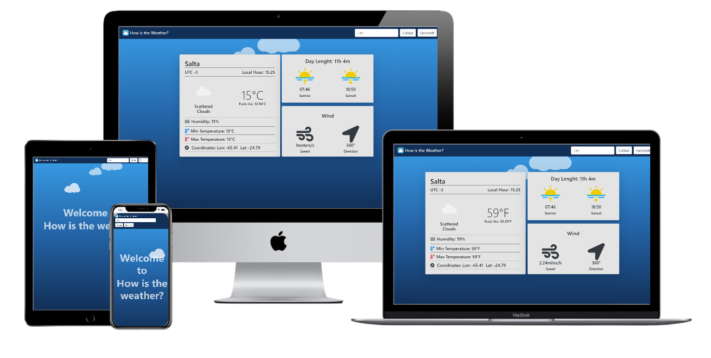

# Weather-App-JS

I built this weather app using HTML5, CSS3, JavaScript. The weather information is retrieved form Open-Weather API.

[Click To Check The Project Details](https://www.theodinproject.com/courses/javascript/lessons/weather-app)

## ScreenShots




## Live Version

Live version [here](https://salvador-on.github.io/Weather-App-JS/).

## Author

**Salvador Olvera**
- Linkedin: [Salvador Olvera](https://www.linkedin.com/in/salvador-olvera-n)
- Github: [@Salvador-ON](https://github.com/Salvador-ON)
- Twitter: [@Salvador Olvera_ON](https://twitter.com/Salvador_ON) 

## Used Tools

- HTML
- CSS
- JavaScript

## Setup

Open your git bash and cd to the location you'd like to put your files the run the command below.

```console
git clone https://github.com/Salvador-ON/Weather-App-JS.git
```


