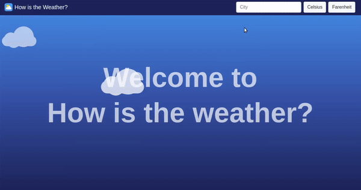

# Weather-App-JS

A Simple Weather-App with html and js .

[Click To Check The Project Details](https://www.theodinproject.com/courses/javascript/lessons/weather-app)

## Author

**Salvador Olvera**
- Linkedin: [Salvador Olvera](https://www.linkedin.com/in/salvador-olvera-n)
- Github: [@Salvador-ON](https://github.com/Salvador-ON)
- Twitter: [@Salvador Olvera_ON](https://twitter.com/Salvador_ON) 

## Used Tools

- HTML
- CSS
- JavaScript


## Done Work

- [x] Build Static Html.
- [X] Build Program Logic.
- [X] Request Celsius information.
- [X] Request Farenheit information. 
- [X] Display the information.
- [X] Use webpack.
- [X] Use ES6.

## Setup

Open your git bash and cd to the location you'd like to put your files the run the command below.

```console
git clone https://github.com/Salvador-ON/Weather-App-JS.git
```

## Live Version

Live version [here](https://salvador-on.github.io/Weather-App-JS/).

## ScreenShots


